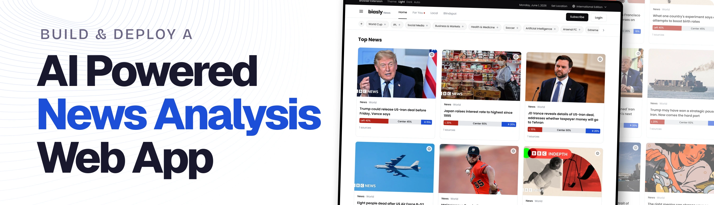

<div align="center">
  <br />
    <a href="https://youtu.be/tz-CPq3WgeA" target="_blank">
      
    </a>
  <br />

  <div>


<br />


<br />


  </div>

  <h3 align="center">Skew | AI-Powered News Bias Analyzer</h3>

   <div align="center">
     Build this project step by step with our detailed tutorial on <a href="https://www.youtube.com/watch?v=XUkNR-JfHwo" target="_blank"><b>JavaScript Mastery</b></a> YouTube. Join the JSM family!
    </div>
</div>

## 📋 <a name="table">Table of Contents</a>

1. ✨ [Introduction](#introduction)
2. ⚙️ [Tech Stack](#tech-stack)
3. 🔋 [Features](#features)
4. 🤸 [Quick Start](#quick-start)
5. 🔗 [Assets](#links)
6. 🚀 [More](#more)

## 🚨 Tutorial

This repository contains the code corresponding to an in-depth tutorial available on our YouTube channel, <a href="https://www.youtube.com/@javascriptmastery/videos" target="_blank"><b>JavaScript Mastery</b></a>.

If you prefer visual learning, this is the perfect resource for you. Follow our tutorial to learn how to build projects like these step-by-step in a beginner-friendly manner!

<a href="https://youtu.be/tz-CPq3WgeA" target="_blank"></a>

## <a name="introduction">✨ Introduction</a>

Skew is a full-stack AI news platform that scrapes real articles from multiple sources, analyzes each one for sentiment and political framing, and surfaces a bias breakdown before you ever open the story. Every article card shows a bias metric; every details page shows the full AI-estimated framing, and a pgvector-powered Related Articles section connects stories by meaning instead of shared keywords, so the whole feed refreshes itself every hour with nobody at the keyboard.

Skew is also built with **Vibe Engineering**: an `AGENTS.md` file defines the project's rules, architecture, and data model once, so the AI coding agent reads it before every feature, drafts its own implementation prompt, and only writes code after you approve it. Every route, page, and pipeline in this repo was shipped through that same prompt → approve → build loop.

If you're getting started and need assistance or face any bugs, join our active Discord community with over **50k+** members. It's a place where people help each other out.

<a href="https://discord.com/invite/n6EdbFJ" target="_blank"></a>

## <a name="tech-stack">⚙️ Tech Stack</a>

- **[Next.js](https://nextjs.org/)** is a production-ready React framework offering server-side rendering, the App Router, and API routes. It powers Skew's full stack, from the authenticated UI to the scraping and analysis API endpoints.

- **[TypeScript](https://www.typescriptlang.org/)** is a strongly typed superset of JavaScript that adds static type definitions across the codebase, keeping the data model, Supabase queries, and AI-validated analysis output type-safe end to end.

- **[Tailwind CSS](https://tailwindcss.com/)** is a utility-first CSS framework used to build Skew's responsive design system, from article cards to the bias breakdown UI, directly in markup.

- **[Supabase](https://jsm.dev/skew-supabase)** is the Postgres-based backend that acts as Skew's single source of truth. It stores sources, articles, AI analyses, and scraping logs, and its **pgvector** extension powers the semantic Related Articles search.

- **[Clerk](https://jsm.dev/skew-clerk)** is a complete authentication and user-management platform. It provides sign-in, sign-up, middleware, and protected routes, so identity is fully handled without hand-rolled auth screens or session logic.

- **[Oxylabs](https://oxylabs.io/javascript)** is a web data platform whose Web Scraper API gives uninterrupted access to real news homepages, and whose Scheduler runs those fetches on a recurring basis, powering Skew's hourly scrape.

- **[Vercel AI SDK](https://sdk.vercel.ai/)** is used with **OpenAI GPT-4o** to run structured article analysis — sentiment, framing labels, framing percentages, and a neutral summary — validated with Zod before it's ever saved.

- **[OpenAI](https://openai.com/)** models power both the article analysis calls and the `text-embedding-3-small` embeddings that pgvector uses to find related stories by meaning.

- **[PostHog](https://jsm.dev/skew-posthog)** is the product analytics and session replay layer, used here to move beyond dashboards toward self-driving insights: agents that read product data and can open a pull request with a fix attached.

- **[Vercel Cron](https://vercel.com/docs/cron-jobs)** triggers Skew's pipeline route on a schedule, processing completed Oxylabs scrapes and running AI analysis automatically, hour after hour, once deployed.

## <a name="features">🔋 Features</a>

👉 **Real Scraped News Feed**: A home page of real articles pulled from configured sources, with a bias metric shown right on every card.

👉 **AI Bias & Sentiment Analysis**: Each article is scored for sentiment, an AI-estimated political framing label, and left / center / right percentages that always add up to 100 — clearly disclosed as an estimate, not objective truth.

👉 **News Details Page**: Full article view with the AI-generated summary, sentiment, framing breakdown, framing notes, and loaded terms for the story.

👉 **Related Articles by Meaning**: A pgvector-powered semantic search that surfaces similar stories by what they're actually about, not by shared keywords or source.

👉 **Authentication**: Clerk-powered sign-in and sign-up, middleware-protected routes, and redirect handling, with the home feed staying public.

👉 **Fully Automated Pipeline**: Oxylabs Scheduler scrapes active sources hourly, and Vercel Cron processes and analyzes the results 15 minutes later — fresh, bias-scored news with no manual trigger.

👉 **Self-Driving Analytics**: PostHog session replay and event tracking, wired up to read product data and surface (or even draft fixes for) issues automatically.

And many more, including code architecture and reusability.

## <a name="quick-start">🤸 Quick Start</a>

Follow these steps to set up the project locally on your machine.

**Prerequisites**

Make sure you have the following installed on your machine:

- [Git](https://git-scm.com/)
- [Node.js](https://nodejs.org/en)
- [npm](https://www.npmjs.com/) (Node Package Manager)

**Cloning the Repository**

```bash
git clone https://github.com/adrianhajdin/skew_news.git
cd skew_news

```

**Installation**

Install the project dependencies using npm:

```bash
npm install
```

**Set Up Environment Variables**

Create a new file named `.env.local` in the root of your project and add the following content:

```env
NEXT_PUBLIC_CLERK_PUBLISHABLE_KEY=
CLERK_SECRET_KEY=
NEXT_PUBLIC_CLERK_SIGN_IN_URL=/sign-in
NEXT_PUBLIC_CLERK_SIGN_UP_URL=/sign-up
NEXT_PUBLIC_CLERK_SIGN_IN_FALLBACK_REDIRECT_URL=/
NEXT_PUBLIC_CLERK_SIGN_UP_FALLBACK_REDIRECT_URL=/

NEXT_PUBLIC_SUPABASE_URL=
NEXT_PUBLIC_SUPABASE_ANON_KEY=
SUPABASE_SERVICE_ROLE_KEY=

OXY_WSA_USERNAME=
OXY_WSA_PASSWORD=
BIASLY_ADMIN_SECRET=

OPENAI_API_KEY=
ANALYSIS_BATCH_SIZE= 

CRON_SECRET=
```

Replace the placeholder values with your real credentials. You can get these by signing up at: [**Clerk**](https://jsm.dev/skew-clerk), [**Supabase**](https://jsm.dev/skew-supabase), [**Oxylabs**](https://oxylabs.io/javascript), [**OpenAI**](https://platform.openai.com/), [**PostHog**](https://jsm.dev/skew-posthog).

**Set Up the Database**

- Open the Supabase dashboard, go to the SQL editor
- Paste the contents of `supabase/schema.sql` and run it to create the `sources`, `articles`, `article_analyses`, `logs`, `oxylabs_schedules`, and `oxylabs_schedule_runs` tables (plus the pgvector `embedding` column and cosine index)
- Paste the contents of `supabase/seed.sql` and run it to seed a handful of active news sources

**Running the Project**

```bash
npm run dev
```

Open [http://localhost:3000](http://localhost:3000) in your browser to view the project.

**Trigger the Pipeline Manually**

With the dev server running, scrape and analyze on demand:

```bash
curl -X POST http://localhost:3000/api/scrape \
  -H "Content-Type: application/json" \
  -H "x-biasly-admin-secret: YOUR_SECRET" \
  -d '{}'

curl -X POST http://localhost:3000/api/analyze \
  -H "Content-Type: application/json" \
  -H "x-biasly-admin-secret: YOUR_SECRET" \
  -d '{}'
```

**Automate It (Oxylabs Scheduler + Vercel Cron)**

Once deployed, Skew keeps itself fresh on its own:

```bash
curl -X POST http://localhost:3000/api/oxylabs/schedules \
  -H "Content-Type: application/json" \
  -H "x-biasly-admin-secret: YOUR_SECRET"
```

This registers one Oxylabs schedule per active source. `vercel.json` schedules `/api/cron/pipeline` for 15 minutes past every hour — Vercel Cron only runs once deployed, and the route is protected in production by a `CRON_SECRET` set in your Vercel project settings (not in `.env.local`).

## <a name="links">🔗 Assets</a>

Assets and snippets used in the project can be found in the **[video kit](https://jsmastery.com/video-kit/9db9fd14-7180-4bb6-be73-60b85d89d7d6)**.

<a href="https://jsmastery.com/video-kit/9db9fd14-7180-4bb6-be73-60b85d89d7d6" target="_blank">
  
</a>

## <a name="more">🚀 More</a>

**Advance your skills with our Pro Course**

Enjoyed creating this project? Dive deeper into our PRO courses for a richer learning adventure. They're packed with
detailed explanations, cool features, and exercises to boost your skills. Give it a go!

<a href="http://jsmastery.com/" target="_blank">
  
</a>